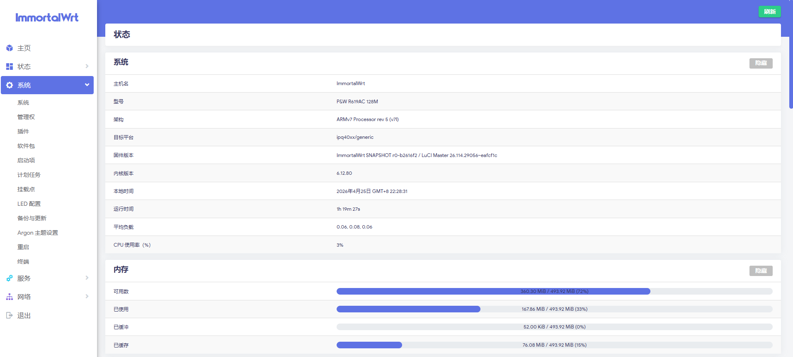

# P2W-R619AC ImmortalWrt 自用固件编译

本项目用于通过 GitHub Actions 自动化编译 **竞斗云2.0 R619AC (P2W-R619AC)** 路由器的 ImmortalWrt 固件。这是一个为自用量身打造的优化项目，并同步支持最新的 ImmortalWrt 主分支（Master）、24.10.2 稳定分支和 25.12 分支。

## 🏮 固件默认配置

刷入固件后，请参考以下默认配置进行路由器的初始化设置：

- **后台地址**: [192.168.88.1](http://192.168.88.1)
- **管理账号**: `root`
- **管理密码**: 无密码 *(为了安全，请在初次直接登入后自行设定密码)*
- **Wi-Fi 名称**: `ImmortalWrt` 或 `OpenWrt`
- **Wi-Fi 密码**: 无密码

## 🌟 特色集成与优化

在原版 ImmortalWrt 基础上，固件额外包含了以下自用优化与定制调整：

- 🎨 **默认主题优化**：将默认相对基础的 Bootstrap 主题直接替换为更现代、美观的 **Argon** 主题。

- 🛡️ **DNS 增强机制**：移除了原生的 mosdns 及 geo 数据包，重新集成了 [sbwml 维护的 mosdns v5](https://github.com/sbwml/luci-app-mosdns) 以及更完善的geoip2数据库，预置个人优化的配置文件，解决 DNS 污染兼顾国内直连速度。

- 🌐 **本地化与小优化**：拉取最新的中文化默认设定包，固件名称编译时自动打上时间戳前缀，方便版本控制。

- 🔗 **frpc（内网穿透）**：集成了 frp 客户端，支持自定义配置，实现内网设备的远程访问。

- 🌍 **ddnsgo（动态 DNS）**：内置 ddnsgo，实现公网 IP 变化时自动更新域名解析。

- 🖨️ **910nd（打印机）**：添加了 910nd 打印机插件，支持通过 USB/网络打印机直接打印。

- 🧩 **自用LuCI 插件**：集成了 Lucky、网络设置向导、高级设置、计划任务，以及上网时间控制等。

  

## 🚀 自动编译策略

系统设置了十分灵活的自动化编译机制：

1. **版本支持**:
   - 提供了基于 `ImmortalWrt 24.10.2` 的稳定版本工作流。
   - 提供了基于 `ImmortalWrt 25.12` 的版本工作流。
   - 提供了基于 `ImmortalWrt Master` 分支的滚动更新工作流。
2. **触发方式**:
   - 📅 **定时构建**: `24.10.2` 与 `25.12` 工作流默认都会在每月的 28 日自动执行构建并发布。
   - 🖱️ **手动触发**: `Master`、`24.10.2` 与 `25.12` 工作流都支持在 `Actions` 页面手动运行，且支持勾选 tmate 进入 SSH debug 模式。

## 📥 获取与下载固件

所有编译成功的固件都会自动打包发布至本仓库的 **[Releases](../../releases)** 页面中。
为节省空间资源并保持清爽，系统每次发布时都会自动清理旧历史遗留，仅保留最近的 **6 个最新 Release 版本**。

---

> **致谢 & 声明**:
> 大量编译脚本逻辑源自于 [P3TERX/Actions-OpenWrt](https://github.com/P3TERX/Actions-OpenWrt) 项目。
> 源码底包基于 [ImmortalWrt](https://github.com/immortalwrt/immortalwrt) 团队的贡献。

## 📚 资源链接

- 最新 opboot: [opboot-p2w-r619ac-nor-v1.1.2-3d5736d.img](https://github.com/vbskycn/immortalwrt-src/releases/download/P2W-R619AC/opboot-p2w-r619ac-nor-v1.1.2-3d5736d.img)
- 128M 底包: [openwrt-ipq40xx-p2w_r619ac-128m-squashfs-nand-factory.ubi](https://github.com/vbskycn/immortalwrt-src/releases/download/P2W-R619AC/openwrt-ipq40xx-p2w_r619ac-128m-squashfs-nand-factory.ubi)
